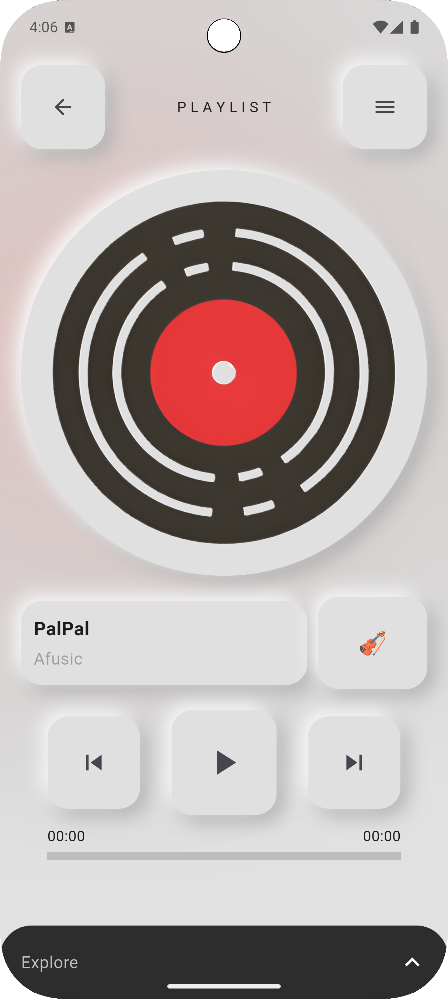
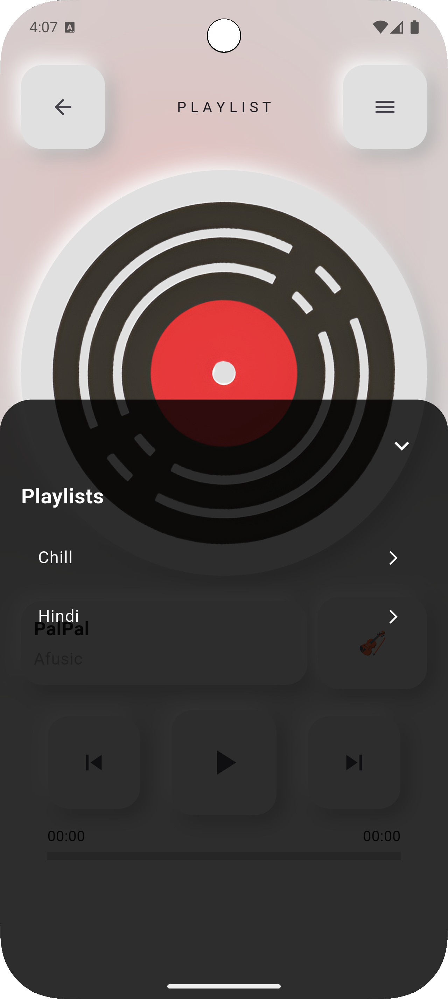

# 🎧 Sono Demo – Neumorphic Flutter Music Player (Preview Only)

**Sono Demo** is a public **preview repository** showcasing the features, UI, and functionality of the full **Sono Music Player** app — a Flutter-based streaming music player with a beautiful **neumorphic design**.

> 🔒 This repository contains **no source code**, but serves as a visual and informational **demo** of the full private project.

---

## ✨ Key Features

- 🎶 **Online MP3 Streaming** from cloud storage
- 🌟 **Neumorphic UI** with smooth gradients and depth
- 💫 **Rotating Album Art** and glowing effects
- 📀 **Metadata Extraction** using Python automation
- 🔁 Loop, play, and pause controls with emoji reactions
- ☁️ Firebase Firestore + Storage integration
- 🧠 State management using Provider

---

## 📸 App UI – Screenshots

<table>
  <tr>
    <td></td>
    <td></td>
  </tr>
  <tr>
    <td align="center">🏠 Home Page</td>
    <td align="center">🎵 Playlist Bar</td>
  </tr>
</table>

> More screenshots coming soon!

---

## 📂 What's Inside – Original Project Structure

```bash
Sono/
├── lib/
│   ├── main.dart
│   ├── firebase_options.dart
│   ├── models/
│   │   ├── menu_button.dart
│   │   ├── playlist_provider.dart
│   │   ├── song.dart
│   │   └── song_service.dart
│   └── pages/
│       ├── home_page.dart
│       ├── neumorphic_bots.dart
│       ├── neumorphic2.dart
│       └── splash_screen.dart
│
├── music-uploader/
│   ├── upload_metadata.py         # 🔁 Uploads GitHub MP3 metadata to Firestore
│   ├── serviceAccountKey.json     # 🔐 Firebase Admin SDK credentials
│   ├── google-services.json       # 🔗 Android Firebase config
│   ├── venv/                      # 🐍 Virtual environment (optional)
│   └── temp/                      # 📂 Temporary directory for downloaded MP3s
│
├── .gitignore
├── pubspec.yaml
└── README.md
-----

🛠 About the Full App

The full version of Sono is a complete Flutter music player that:

    Uses Firebase Firestore to store metadata

    Streams music hosted on GitHub or Firebase Storage

    Features a fully customized neumorphic UI

    Automatically uploads metadata via Python

To request access to the private full project or to learn more, please contact the author.
📄 Metadata Uploader (Preview)

The backend for this project includes a Python script that:

    Extracts metadata from .mp3 files

    Automatically uploads song info to Firestore

    Supports GitHub-hosted MP3s for cloud streaming

📎 View Python Script on GitHub:
upload_metadata.py → GitHub
👨‍💻 Author

Abhiram S
GitHub: @Abhiram086

    📢 This is a demo repository for display purposes only. The full app and source code are kept private for development and deployment.
